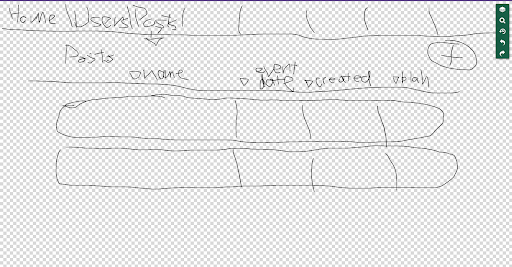
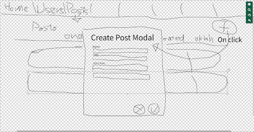
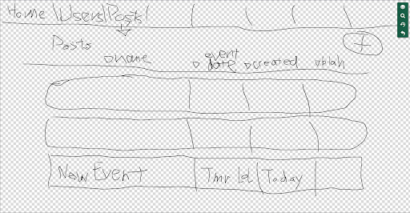
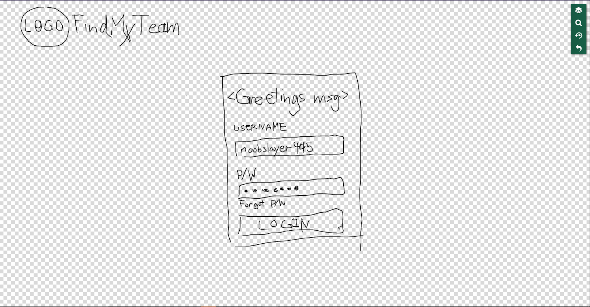
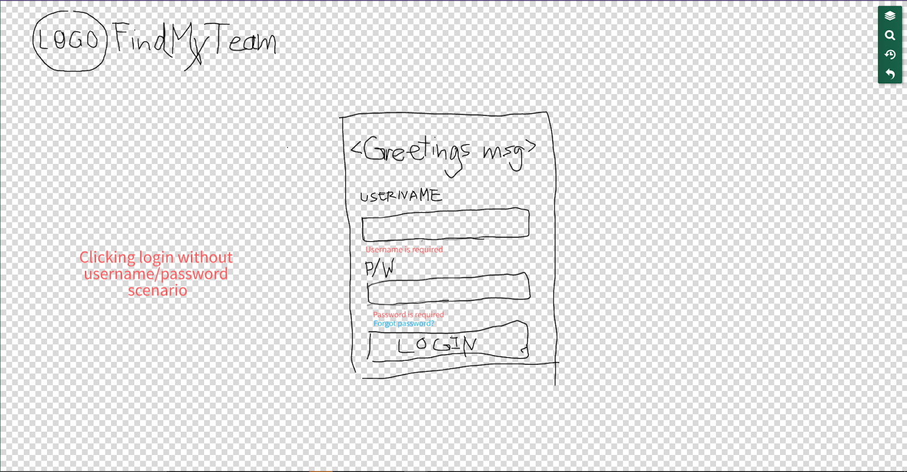
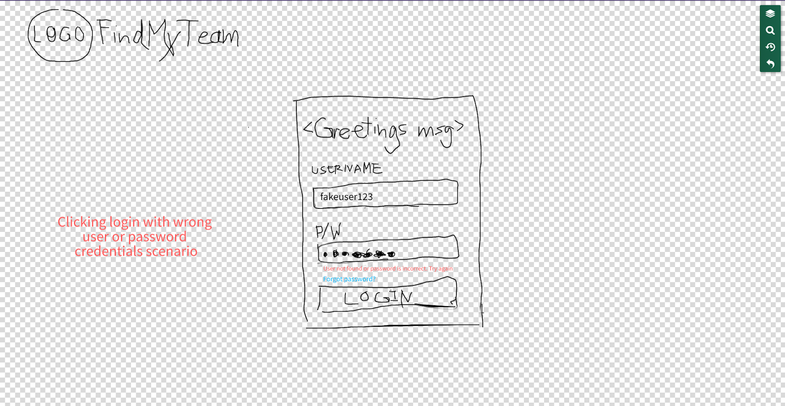

# Project Description #

This application is for anyone interested in looking for a sports team or group to play with in their area, be it recreational or amateur. Users can make postings day of or for a future date, seeking other users to join their activity / sport. Other users can then look for pre-existing groups and join them.
The application will store user data (Eg., a profile: name, profile picture, email address, interests / sports they play), group data (group name, users in the group, group interests / type / genre), posting data (event name, event date, event duration, event type, event location, event size, participants, comments on the post). Users would be able to make a profile, see other people’s profiles (and contact through email), join / create groups, and make postings or interact with existing postings. Users will be able to search for other users or groups with similar interests.
Additional functionality may include shareability of event postings with other users / groups, creating leagues, and publicity of groups.

# Project Requirements #
## Minimal Requirements ##
* User can create an account (and login to account)
* Users can create an event (and delete own events) 
* Users can join events

## Standard Requirements ##
* Users can add other users as contacts / friends (and remove users as friends)
* Users can search for other users with similar interests
* Users can create groups
* Users can join existing groups
* Users can comment on event postings (preset options as well? Going, Not Going?)

## Stretch Requirements ##
* Users can share event postings with other friends or groups
* Users can create leagues (recurring events) with standings/brackets/etc.
* Groups can be public searchable groups or private groups
* In app Google maps for event location

# Prototypes #
## Add New Event Post Workflow ##

