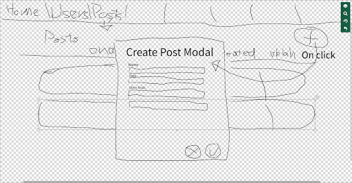
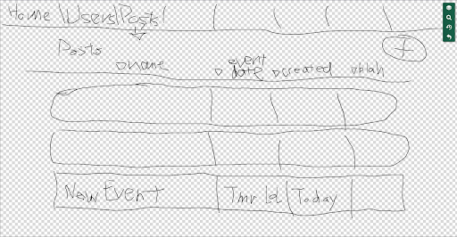
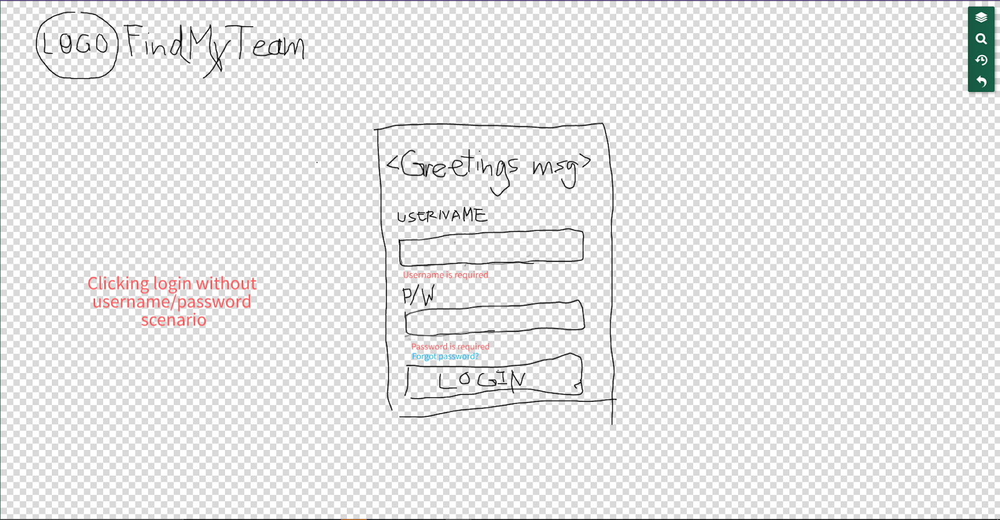
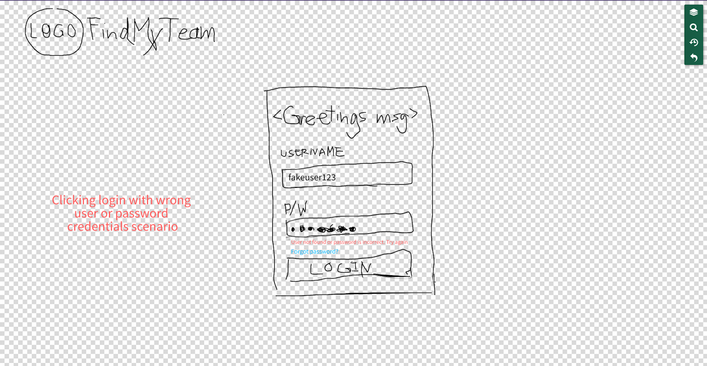

# 1. Project Description #

FindMyTeam is a web app for anyone looking to join events or groups, 
meet up with other people, meet new people, or try new activities!
Users can create event postings and join events posted by other users, 
and similarly create groups and join groups created by other users.

The application will store user data (Eg., a profile: name, profile picture, email address, interests / sports they play), 
group data (group name, users in the group, group interests / type / genre), 
posting data (event name, event date, event duration, event type, event location, event size, participants, comments on the post). 

Users would be able to make a profile, see other people’s profiles (and contact through email), join / create events and groups, 
and make postings or interact with existing postings. 
Users will be able to search for other users or groups with similar interests. 
Additional functionality may include shareability of event postings with other users / groups, creating leagues, and publicity of groups.

# 2. Project Requirements #
## Minimal Requirements ##
[:heavy_check_mark:] User can create an account (and login to account)  
- [:heavy_check_mark:] Create landing page (login page)  
- [:heavy_check_mark:] Setup database connection  
  - [:heavy_check_mark:] Find good way to store login data   

[:heavy_check_mark:] Find method of secure authentication  
[:heavy_check_mark:] Create ‘create account page’  

[:heavy_check_mark:] Users can create an event (and delete own events)  
- [:heavy_check_mark:] Create “create event” button  
- [:heavy_check_mark:] Create modal for event building or another page  
- [:heavy_check_mark:] Create “delete event” button  

[:heavy_check_mark:] Users can join events   

## Standard Requirements ##
[:grey_exclamation:] Users can search
- [:heavy_check_mark:] events
- [:heavy_check_mark:] groups
- [:heavy_check_mark:] people
- [:x:] tags

[:heavy_check_mark:] Users can create groups  
[:heavy_check_mark:] Users can join existing groups  
[:heavy_check_mark:] Users can comment on event postings (preset options as well? Going, Not Going?)

## Stretch Requirements ##
[:heavy_check_mark:] In app Mapbox / Google Maps API for event location  
[:x:] Users can add other users as contacts / friends (and remove users as friends)  
[:x:] Users can share event postings with other friends or groups  
[:x:] Users can create leagues (recurring events) with standings/brackets/etc.  
[:x:] Groups can be public searchable groups or private groups  

# 3. Technology Used #
### HTML, CSS, JS
JS is the main language our of app, as JS is great for web application development (easy to use client side and server side).
HTML is used in the form of JSX for React components, and is what helps render our code onto the webpage. 
CSS is used with Material UI styled components and occasionally inline, as well as props for Material UI components,
to help give our components and elements life, by providing color and design.

### React 
React is used for building UI components, which allows for better readability, reusability, and general tidiness of the app,
both in code and in the user interface. 
We used the Material UI library to create most of our components, as it provides as a good template to work off of (a lot of prebuilt common components, such as Lists, Navs, Icons, Cards, Buttons, etc).
We used a mixture of Redux and React hooks to manage state, 
as Redux helped with global state management and API response payloads (through the use of actions and reducers), 
and the React hooks were great for specific component state (eg., useState for button clicks, input fields).
Axios is used to make HTTP requests.

### Node & Express
Node is used to create the backend Express app.
This is where all our HTTP (GET, POST, DELETE, PUT/PATCH) requests were routed to, handled, 
and returned with proper data to the frontend (client).
We used the Express template to build our three main routes: events, groups, and users endpoints, to handle
CRUD (create, read, update, delete) / REST API calls, and to connect and fetch data from the DB.

### NoSQL with MongoDB
We used MongoDB for permanent unified storage of our User, Events, and Group collections. 
Users client-side would have their data and posts saved here, and update or deleted when necesary, through the express server.
Mongoose is used to help model our data, and for schema validation (moving data across client, server, and DB).

### Release Engineering
We are using Heroku to host and deploy our application, as Heroku provides a place to keep our application running for public use. 
We have it integrated such that we have CI / CD - every push to the master branch Heroku will rebuild and redeploy the app, 
providing users with the most up to date version of the application.
The application file structure was modified to make it more deployable - the frontend now sits within the express app (root), 
and on deployment, a static version of the client is built, for the server to serve.

# 4. Above and Beyond #
A Mapbox API was used so users can connect events with locations on a map, which serves as a core purpose of our application 
(to set up events, and meet people in real time to participate in said event). 

# 5. Next Steps #
We have a very basic MVP set up, as seen by the stretch goals we have yet to hit, 
there are more features lined up that are not currently implemented (eg., adding contacts, sharing events / groups).  
There are also working functionality that can be improved on, and certain parts of the code that could potentially be refactored / 
made more efficient, as noted by the `TODOs` in the code. 
Some examples include having more admin actions for the group owner, adding photos to events, allowing more actions for commenting, etc.

# 6. Contributions #
- contributions can also be noted from PRs, and in the Project tab (some tickets have names attached for work done)

Lucas Gustafson (u8h2b):

Philip Ng (s3d1b): 
- project managed(?), led some scrums, wrote tickets (under repo "projects"), led some designs, and wrote documentation
- worked on unifying UI, color scheme, navigation bar and the starting point for the homepage
- a lot of decision making into how Redux state should look, and how we should store and manage data
- worked on Groups page; group creation, deletion, displaying group events (and the group details page) and group related endpoints
  - ability for user to join and leave groups, and user related endpoints and state management
- edit functionality and modal for groups / events
- initiated the snackbar 
- set up CI / CD from Heroku
- holistic app changes (to make it more unified, went into Events after Lucas built the foundation)

Samson Tsui (o5e1b):

Sidney Lu (b2p1b):

# Prototypes #
## Add New Event Post Workflow ##

## Login Workflow ##

---
