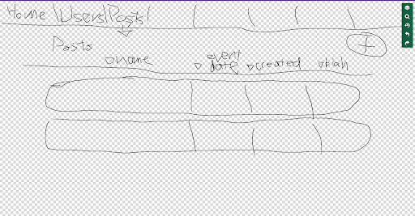
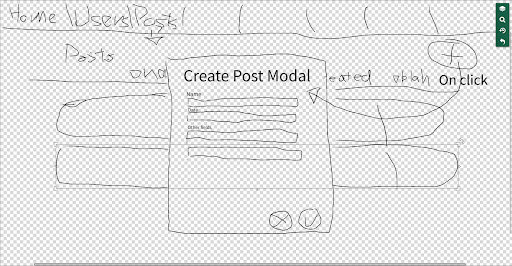

# Project Description #

This application is for anyone interested in looking for a sports team or group to play with in their area, be it recreational or amateur. Users can make postings day of or for a future date, seeking other users to join their activity / sport. Other users can then look for pre-existing groups and join them.
The application will store user data (Eg., a profile: name, profile picture, email address, interests / sports they play), group data (group name, users in the group, group interests / type / genre), posting data (event name, event date, event duration, event type, event location, event size, participants, comments on the post). Users would be able to make a profile, see other people’s profiles (and contact through email), join / create groups, and make postings or interact with existing postings. Users will be able to search for other users or groups with similar interests.
Additional functionality may include shareability of event postings with other users / groups, creating leagues, and publicity of groups.

# Project Requirements #
## Minimal Requirements ##
* User can create an account (and login to account)
  * Create landing page
  * Setup database connection
    * Find good way to store login data
  * Find method of secure authentication
  * Create ‘create account page’

* Users can create an event (and delete own events)
  * Create “create event” button
  * Create modal for event building or another page
  * Create “delete event” button

* Users can join events

## Standard Requirements ##
* Users can add other users as contacts / friends (and remove users as friends)
* Users can search for other users with similar interests
* Users can create groups
* Users can join existing groups
* Users can comment on event postings (preset options as well? Going, Not Going?)

## Stretch Requirements ##
* Users can share event postings with other friends or groups
* Users can create leagues (recurring events) with standings/brackets/etc.
* Groups can be public searchable groups or private groups
* In app Google maps for event location

# Prototypes #
## Add New Event Post Workflow ##

## Login Workflow ##

---

# Getting Started with Create React App

This project was bootstrapped with [Create React App](https://github.com/facebook/create-react-app).

## Available Scripts

In the project directory, you can run:

### `yarn start`

Runs the app in the development mode.\
Open [http://localhost:3000](http://localhost:3000) to view it in the browser.

The page will reload if you make edits.\
You will also see any lint errors in the console.

### `yarn test`

Launches the test runner in the interactive watch mode.\
See the section about [running tests](https://facebook.github.io/create-react-app/docs/running-tests) for more information.

### `yarn build`

Builds the app for production to the `build` folder.\
It correctly bundles React in production mode and optimizes the build for the best performance.

The build is minified and the filenames include the hashes.\
Your app is ready to be deployed!

See the section about [deployment](https://facebook.github.io/create-react-app/docs/deployment) for more information.

### `yarn eject`

**Note: this is a one-way operation. Once you `eject`, you can’t go back!**

If you aren’t satisfied with the build tool and configuration choices, you can `eject` at any time. This command will remove the single build dependency from your project.

Instead, it will copy all the configuration files and the transitive dependencies (webpack, Babel, ESLint, etc) right into your project so you have full control over them. All of the commands except `eject` will still work, but they will point to the copied scripts so you can tweak them. At this point you’re on your own.

You don’t have to ever use `eject`. The curated feature set is suitable for small and middle deployments, and you shouldn’t feel obligated to use this feature. However we understand that this tool wouldn’t be useful if you couldn’t customize it when you are ready for it.

## Learn More

You can learn more in the [Create React App documentation](https://facebook.github.io/create-react-app/docs/getting-started).

To learn React, check out the [React documentation](https://reactjs.org/).

### Code Splitting

This section has moved here: [https://facebook.github.io/create-react-app/docs/code-splitting](https://facebook.github.io/create-react-app/docs/code-splitting)

### Analyzing the Bundle Size

This section has moved here: [https://facebook.github.io/create-react-app/docs/analyzing-the-bundle-size](https://facebook.github.io/create-react-app/docs/analyzing-the-bundle-size)

### Making a Progressive Web App

This section has moved here: [https://facebook.github.io/create-react-app/docs/making-a-progressive-web-app](https://facebook.github.io/create-react-app/docs/making-a-progressive-web-app)

### Advanced Configuration

This section has moved here: [https://facebook.github.io/create-react-app/docs/advanced-configuration](https://facebook.github.io/create-react-app/docs/advanced-configuration)

### Deployment

This section has moved here: [https://facebook.github.io/create-react-app/docs/deployment](https://facebook.github.io/create-react-app/docs/deployment)

### `yarn build` fails to minify

This section has moved here: [https://facebook.github.io/create-react-app/docs/troubleshooting#npm-run-build-fails-to-minify](https://facebook.github.io/create-react-app/docs/troubleshooting#npm-run-build-fails-to-minify)
